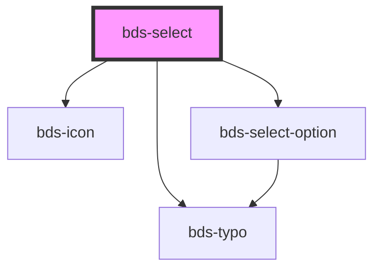

# bds-select

<!-- Auto Generated Below -->

## Properties

| Property          | Attribute          | Description                                                                                                                                                                                                                                                                                   | Type                    | Default      |
| ----------------- | ------------------ | --------------------------------------------------------------------------------------------------------------------------------------------------------------------------------------------------------------------------------------------------------------------------------------------- | ----------------------- | ------------ |
| `danger`          | `danger`           | Add state danger on input, use for use feedback.                                                                                                                                                                                                                                              | `boolean`               | `false`      |
| `disabled`        | `disabled`         | Disabled input.                                                                                                                                                                                                                                                                               | `boolean`               | `false`      |
| `icon`            | `icon`             | used for add icon in input left. Uses the bds-icon component.                                                                                                                                                                                                                                 | `string`                | `''`         |
| `label`           | `label`            | label in input, with he the input size increases.                                                                                                                                                                                                                                             | `string`                | `''`         |
| `labelWithValue`  | `label-with-value` | The size of select                                                                                                                                                                                                                                                                            | `boolean`               | `true`       |
| `options`         | `options`          | The options of the select Should be passed this way: options='[{"value": "Cat", "label": "Meow"}, {"value": "Dog", "label": "Woof"}]' Options can also be passed as child by using bds-select-option component, but passing as a child you may have some compatibility problems with Angular. | `Option[] \| string`    | `undefined`  |
| `optionsPosition` | `options-position` | Set the placement of the options menu. Can be 'bottom' or 'top'.                                                                                                                                                                                                                              | `"bottom" \| "top"`     | `'bottom'`   |
| `size`            | `size`             | The size of select                                                                                                                                                                                                                                                                            | `"small" \| "standard"` | `'standard'` |
| `value`           | `value`            | the value of the select.                                                                                                                                                                                                                                                                      | `any`                   | `undefined`  |

## Events

| Event       | Description                              | Type                                   |
| ----------- | ---------------------------------------- | -------------------------------------- |
| `bdsBlur`   | Emitted when the select loses focus.     | `CustomEvent<void>`                    |
| `bdsCancel` | Emitted when the selection is cancelled. | `CustomEvent<void>`                    |
| `bdsChange` | Emitted when the value has changed.      | `CustomEvent<SelectChangeEventDetail>` |
| `bdsFocus`  | Emitted when the select loses focus.     | `CustomEvent<void>`                    |

## Dependencies

### Depends on

- [bds-typo](../../typo)
- [bds-icon](../../icon)
- [bds-select-option](../../select-option)

### Graph

----------------------------------------------

*Built with [StencilJS](https://stenciljs.com/)*
